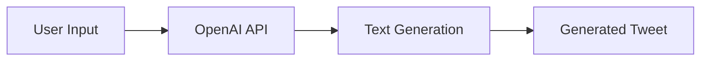

<div align="center">
  <a aria-label="GitHub License" href="https://github.com/igorkowalczyk/tweet-ai/blob/master/license.md">
    
  </a>
  <a aria-label="Version" href="https://github.com/igorkowalczyk/tweet-ai/releases">
    
  </a>
  <a aria-label="Discord" href="https://igorkowalczyk.dev/discord">
    
  </a>
</div>

---

## 🔩 Setup

1. Create an account on [OpenAI](https://openai.com/) and get your API key.
2. Copy `.env.example` to `.env`.
3. Fill the `OPENAI_KEY` and `OPENAI_ORG` variables in `.env` with your API key and organization ID.
4. Install the dependencies with `pnpm install`.
5. Run the script with `pnpm start`.

## 🧠 How it works



## 📷 Example

https://user-images.githubusercontent.com/49127376/207709937-70a8abd2-6a83-4785-94ea-706bde0e6ba9.mp4

## 🗜️ `.env` variables

```dotenv
OPENAI_KEY = "sk-xxxxxxxxxxxxxxxxxxxxxxxxxxxxxxxxxxxxxxxx"
OPENAI_ORG = "org-xxxxxxxxxxxxxxxxxxxxxxxxxxxxxxxxxxxxxxxx"
```

> [!NOTE]
> You can find your API key and organization ID on [OpenAI](https://beta.openai.com/account/api-keys).

## ⁉️ Issues

If you have any issues with the page please create [new issue here](https://github.com/igorkowalczyk/tweet-ai/issues)

## 📥 Pull Requests

When submitting a pull request:

- Clone the repo.
- Create a branch off of master and give it a meaningful name (e.g. my-awesome-new-feature).
- Open a [pull request](https://github.com/igorkowalczyk/tweet-ai/pulls) on [GitHub](https://github.com) and describe the feature or fix.

## 📋 License

This project is licensed under the MIT. See the [LICENSE](https://github.com/igorkowalczyk/tweet-ai/blob/main/license.md) file for details
